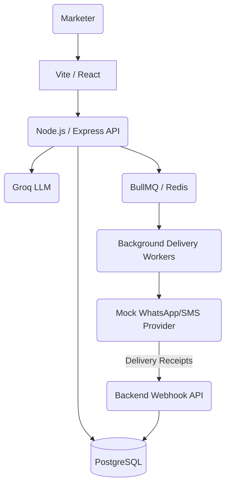

# Xeno CRM: AI-Native Marketing Platform

   

Xeno CRM is a full-stack, AI-driven Marketing Customer Relationship Management system. It allows marketers to ingest customer/order data, dynamically build audience segments via natural language, and execute large-scale personalized messaging campaigns reliably.

---

## 🏗 System Architecture

The application is built as a modern monorepo featuring decoupled services optimized for scalability:



### Core Components

1. **Frontend (SPA):** Built with React, Vite, and TailwindCSS. It provides a real-time dashboard, campaign builder, and an interactive AI Chat interface.
2. **Backend API:** A fast Express.js server providing RESTful endpoints. Uses Prisma ORM for type-safe database interactions.
3. **Database:** PostgreSQL (hosted via Supabase), storing `Customers`, `Orders`, `Segments`, `Campaigns`, and the highly indexed `CampaignRecipient` join table.
4. **AI Service:** Integrates with the Groq API (running `llama-3.3-70b-versatile`). It uses strict system prompting and function/tool-calling to convert natural language into executable JSON actions (e.g., creating database segments).
5. **Message Pipeline (Queue & Workers):** Redis-backed BullMQ is used to decouple campaign creation from message delivery. Instead of blocking the API, large campaigns (e.g., 100,000 users) are batched and executed asynchronously by dedicated workers with retry logic.
6. **Channel Stub:** A mock microservice acting as a 3rd-party provider (like Twilio or Meta). It receives payload requests from the workers and simulates network latency.
7. **Webhook Ingestion:** The backend exposes a `/api/webhooks/receipt` endpoint. The Channel Stub fires asynchronous HTTP POST requests back to this endpoint to update message statuses (`delivered`, `read`, `failed`).

---

## 🚀 The Campaign Pipeline

The core technical pipeline handles the transition from "Intent" to "Delivery & Analytics".

1. **Intent (AI or Manual):** The marketer defines rules (e.g., "Spend > $1000 AND hasn't purchased in 30 days").
2. **Segmentation:** The backend queries the Postgres database and calculates the audience.
3. **Queue Ingestion:** When the marketer hits "Send", the backend creates `pending` records in the `CampaignRecipient` table and pushes a discrete Job for every single recipient into **BullMQ**.
4. **Execution:** Background workers pull jobs from Redis at a controlled concurrency limit to avoid rate-limiting.
5. **Dispatch:** The worker sends the message payload to the Messaging Provider (Channel Stub).
6. **Callback/Webhooks:** The provider processes the message and fires webhooks back to our server. Our server processes the event (e.g., `status: delivered`) and updates the `CampaignRecipient` record.
7. **Analytics/Attribution:** The frontend polls or queries the aggregated statuses to show the marketer a live funnel (Sent -> Delivered -> Opened -> Clicked -> Conversion).

---

## 🧠 AI Chat Deep Dive

The flagship feature is the AI Assistant. It does not just generate text; it actively controls the backend.

- **Context Window:** The chat maintains context via Server-Sent Events (SSE). 
- **Tool Calling:** When a user says *"Target NY users,"* the LLM outputs a strict JSON XML tag: `<action>{"type":"GENERATE_SEGMENT", "payload": {"prompt": "NY users"}}</action>`.
- **Execution:** The frontend intercepts this tag, calls the `POST /api/segments/ai` route, creates the segment via Prisma, and injects the result back into the chat context. 
- **Seamless Handoff:** Once the audience and message are generated, the user can click "Send" directly from the chat window, pushing the job into the BullMQ pipeline.

---

## 🛠 Tech Stack

- **Monorepo Manager:** npm workspaces + concurrently
- **Frontend:** React 18, Vite, TailwindCSS, React Query, Lucide Icons
- **Backend:** Node.js, Express, Prisma ORM, Zod Validation
- **Database:** PostgreSQL (Supabase)
- **Queues/Cache:** Redis (Upstash) + BullMQ
- **AI:** Groq SDK (Llama 3.3)

---

## ⚙️ Running Locally

### 1. Prerequisites
- Node.js (v20+)
- A PostgreSQL database URL
- A Redis instance URL
- A Groq API Key

### 2. Environment Variables
Create a `.env` file in the root directory. Use `.env.example` as a template.
Ensure you provide `DATABASE_URL`, `UPSTASH_REDIS_URL`, and `GROQ_API_KEY`.

### 3. Setup
```bash
# Install all dependencies across workspaces
npm install

# Generate Prisma Client
npm run generate

# Run Database Migrations
npm run migrate

# (Optional) Seed the database with fake customers and orders
npm run seed
```

### 4. Start Development Servers
```bash
# Starts the Backend API, the Channel Stub, and the Frontend UI concurrently
npm run dev
```

- **Frontend UI:** `http://localhost:5173`
- **Backend API:** `http://localhost:3001`
- **Channel Stub:** `http://localhost:4001`

---

## 📈 Future Enhancements

If this system were to be deployed to a true production environment, the following features would be added:
1. **Authentication (JWT/OAuth):** To secure the dashboard and API endpoints.
2. **Webhook Cryptographic Signatures:** To verify that incoming delivery receipts are genuinely from the trusted provider (e.g., verifying `X-Provider-Signature`).
3. **Automated Testing:** Implementation of unit and integration tests using Vitest/Supertest.
4. **Rate Limiting:** Applying `express-rate-limit` to protect the AI API and the database from abuse.
